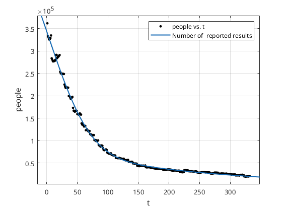

[toc]

# 1

## 1.1Word corrected

First, we found the all allowed words for Wordle game as a dictionary. To ensure words correctness, words from the spreadsheet compared with the dictionary repeated.

```python
def check_words_from_file(words_file, dictionary_file):
    with open(words_file, 'r') as f:
        words_list = [line.strip() for line in f.readlines()]

    with open(dictionary_file, 'r') as f:
        dictionary_words = set(f.read().split())

    all_words_found = True

    for i, word in enumerate(words_list):
        if word not in dictionary_words:
            print(f"{word} is not found in the dictionary (index {i}).")
            all_words_found = False

    if all_words_found:
        print("All words are found in the dictionary!")
    else:
        print("At least one word is not found in the dictionary.")

```

## 1.2Data process

## 1.3Curve fit

Matlab code:

* Exponential:

  * ```matlab
    function [fitresult, gof] = createFit(t, people)
    %CREATEFIT(T,PEOPLE)
    %  Create a fit.
    %
    %  Data for 'Number of  reported results' fit:
    %      X Input: t
    %      Y Output: people
    %  Output:
    %      fitresult : a fit object representing the fit.
    %      gof : structure with goodness-of fit info.
    %% Fit: 'Number of  reported results'.
    [xData, yData] = prepareCurveData( t, people );

    % Set up fittype and options.
    ft = fittype( 'exp2' );
    opts = fitoptions( 'Method', 'NonlinearLeastSquares' );
    opts.Display = 'Off';
    opts.StartPoint = [326384.036739909 -0.022822962438302 54680.2058215826 -0.00245441115529711];

    % Fit model to data.
    [fitresult, gof] = fit( xData, yData, ft, opts );

    % Plot fit with data.
    figure( 'Name', 'Number of  reported results' );
    h = plot( fitresult, xData, yData );
    legend( h, 'people vs. t', 'Number of  reported results', 'Location', 'NorthEast', 'Interpreter', 'none' );
    % Label axes
    xlabel( 't', 'Interpreter', 'none' );
    ylabel( 'people', 'Interpreter', 'none' );
    grid on
    ```

    
* Gaussian
* ```matlab
  function [fitresult, gof] = createFit(t, people)
  %CREATEFIT(T,PEOPLE)
  %  Create a fit.
  %
  %  Data for 'Number of  reported results' fit:
  %      X Input: t
  %      Y Output: people
  %  Output:
  %      fitresult : a fit object representing the fit.
  %      gof : structure with goodness-of fit info.
  %  Auto-generated by MATLAB on 19-Feb-2023 21:45:43
  %% Fit: 'Number of  reported results'.
  [xData, yData] = prepareCurveData( t, people );

  % Set up fittype and options.
  ft = fittype( 'gauss2' );
  opts = fitoptions( 'Method', 'NonlinearLeastSquares' );
  opts.Display = 'Off';
  opts.Lower = [-Inf -Inf 0 -Inf -Inf 0];
  opts.StartPoint = [361908 1 28.2178133341758 153789.112901742 42 37.6745879997992];

  % Fit model to data.
  [fitresult, gof] = fit( xData, yData, ft, opts );

  % Plot fit with data.
  figure( 'Name', 'Number of  reported results' );
  h = plot( fitresult, xData, yData );
  legend( h, 'people vs. t', 'Number of  reported results', 'Location', 'NorthEast', 'Interpreter', 'none' );
  % Label axes
  xlabel( 't', 'Interpreter', 'none' );
  ylabel( 'people', 'Interpreter', 'none' );
  grid on

  ```

  

## 1.4 Distance correlation

```python
from scipy.spatial.distance import pdist, squareform
import numpy as np
import openpyxl


def dist_correlation(X, Y):
    X = np.atleast_1d(X)
    Y = np.atleast_1d(Y)
    if np.prod(X.shape) == len(X):
        X = X[:, None]
    if np.prod(Y.shape) == len(Y):
        Y = Y[:, None]
    X = np.atleast_2d(X)
    Y = np.atleast_2d(Y)
    n = X.shape[0]
    if Y.shape[0] != X.shape[0]:
        raise ValueError('Number of samples must match')
    a = squareform(pdist(X))
    b = squareform(pdist(Y))
    A = a - a.mean(axis=0)[None, :] - a.mean(axis=1)[:, None] + a.mean()
    B = b - b.mean(axis=0)[None, :] - b.mean(axis=1)[:, None] + b.mean()

    dcov2_xy = (A * B).sum() / float(n * n)
    dcov2_xx = (A * A).sum() / float(n * n)
    dcov2_yy = (B * B).sum() / float(n * n)
    dcor = np.sqrt(dcov2_xy) / np.sqrt(np.sqrt(dcov2_xx) * np.sqrt(dcov2_yy))
    return dcor


if __name__ == '__main__':
    wb = openpyxl.load_workbook('E:/Git/mcm/mcm/wordle_data.xlsx')
    sheet = wb.active

    feq_list = []
    ratio_list = []

    for i in range(3, 362):
        feq_list.append(sheet['P'+str(i)].value)
        ratio_list.append(sheet['F'+str(i)].value / sheet['E'+str(i)].value)

    feq_arr = np.array(feq_list, dtype='float16')
    ratio_arr = np.array(ratio_list, dtype='float16')

    print(dist_correlation(feq_arr, ratio_arr))
```

# 2.

## 2.1 Linear regression

```python
import numpy as np
from sklearn.linear_model import LinearRegression
import openpyxl


def load_data():
    wb = openpyxl.load_workbook('E:/Git/mcm/mcm/wordle_data.xlsx')
    sheet = wb.active

    word_freq = []
    letter_freq = []
    repetitive_letter = []
    morphemes_count = []
    for i in range(3, 362):
        word_freq.append(sheet['T' + str(i)].value)
        letter_freq.append(sheet['U' + str(i)].value)
        repetitive_letter.append(sheet['R' + str(i)].value)
        morphemes_count.append(sheet['S' + str(i)].value)

    train_data = [word_freq.copy(), letter_freq.copy(), repetitive_letter.copy(), morphemes_count.copy()]

    word_freq.clear()
    letter_freq.clear()
    repetitive_letter.clear()
    morphemes_count.clear()
    for i in range(303, 362):
        word_freq.append(sheet['T' + str(i)].value)
        letter_freq.append(sheet['U' + str(i)].value)
        repetitive_letter.append(sheet['R' + str(i)].value)
        morphemes_count.append(sheet['S' + str(i)].value)

    test_data = [word_freq, letter_freq, repetitive_letter, morphemes_count]

    return np.array(train_data).T, np.array(test_data).T


def load_label():
    wb = openpyxl.load_workbook('E:/Git/mcm/mcm/wordle_data.xlsx')
    sheet = wb.active

    one_list = []
    two_list = []
    three_list = []
    four_list = []
    five_list = []
    six_list = []
    X_list = []

    for i in range(3, 362):
        one_list.append(sheet['G' + str(i)].value)
        two_list.append(sheet['H' + str(i)].value)
        three_list.append(sheet['I' + str(i)].value)
        four_list.append(sheet['J' + str(i)].value)
        five_list.append(sheet['K' + str(i)].value)
        six_list.append(sheet['L' + str(i)].value)
        X_list.append(sheet['M' + str(i)].value)

    train_label = [one_list.copy(), two_list.copy(), three_list.copy(), four_list.copy(), five_list.copy(),
                   six_list.copy(), X_list.copy()]

    one_list.clear()
    two_list.clear()
    three_list.clear()
    four_list.clear()
    five_list.clear()
    six_list.clear()
    X_list.clear()

    for i in range(303, 362):
        one_list.append(sheet['G' + str(i)].value)
        two_list.append(sheet['H' + str(i)].value)
        three_list.append(sheet['I' + str(i)].value)
        four_list.append(sheet['J' + str(i)].value)
        five_list.append(sheet['K' + str(i)].value)
        six_list.append(sheet['L' + str(i)].value)
        X_list.append(sheet['M' + str(i)].value)

    test_label = [one_list, two_list, three_list, four_list, five_list, six_list, X_list]

    return np.array(train_label).T, np.array(test_label).T


if __name__ == '__main__':
    train_data, test_data = load_data()
    train_label, test_label = load_label()

    model = LinearRegression()
    model.fit(train_data, train_label)
    predictions = model.predict([[0.0012319163158116, 1.13971071663379, 3, 1]])
    print(predictions)

    loss = model.score(train_data, train_label)
    print('R^2: {}'.format(loss))
```
